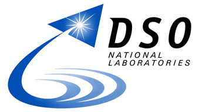
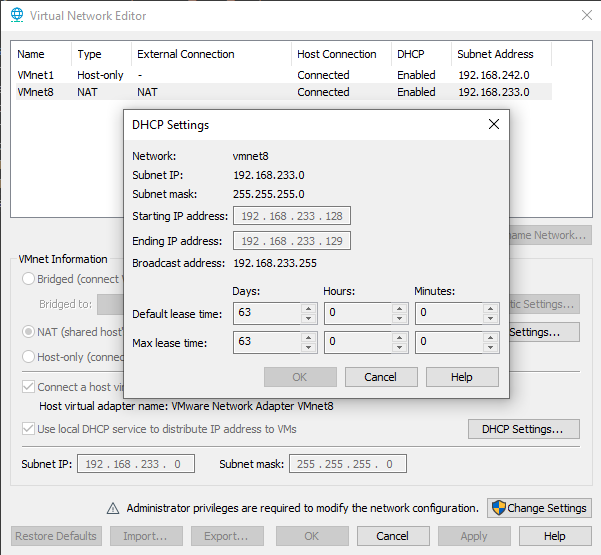
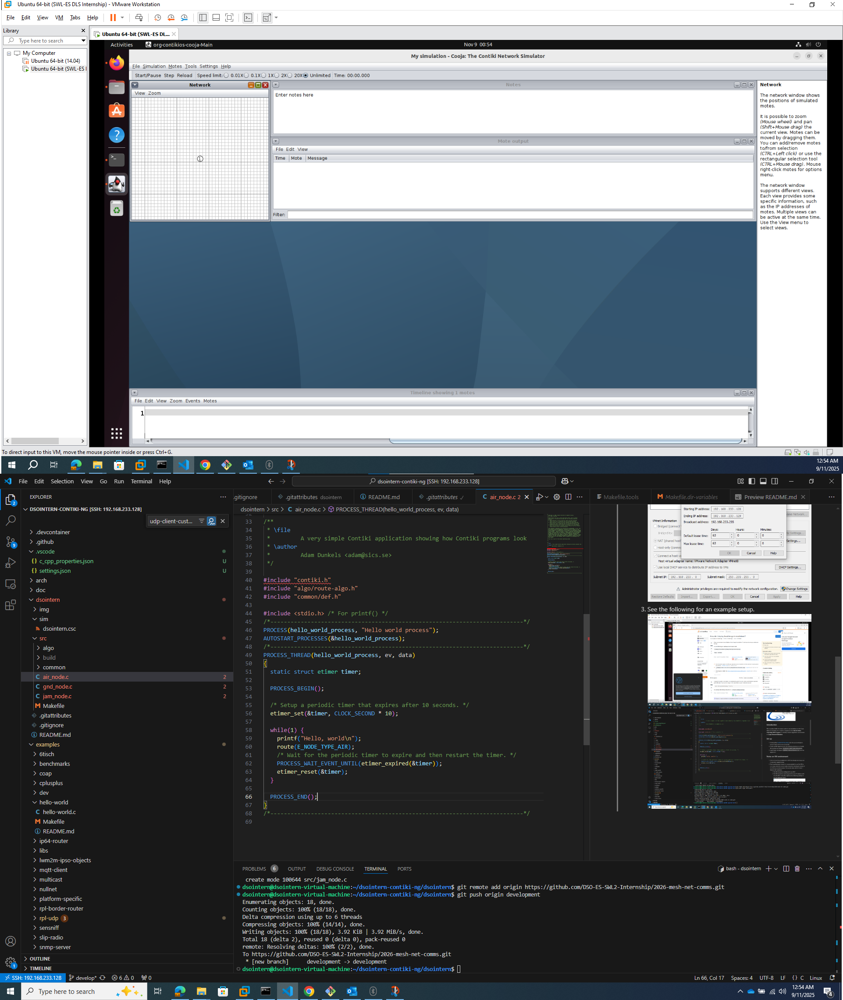

# Real Time Mesh Network Communications System - FANET Simulator

## Introduction
This repository holds the source codes to run simulations on the Network Simulator 3 (`ns3`). It is meant to complement the **DSO ES-SWL2 Internship 2026 Program**, to develop network algorithms and simulation softwares.

## Objectives
- This project seeks to simulate Flying Ad-hoc Mobile Networks.
- The project uses NS3 for predefined routing algorithms, for which the developer may select from in the configuration file for testing.
- The project also emulates cluster networking. 
- The project uses NetAnim to demonstrate the routing applications using a graphical interface.

## Setup
- For intern developers, a VM is to be provided to bootstrap necessary tooling and libraries.
- Otherwise, refer to the required softwares below and install accordingly.

|Category|Software|Remarks|
|-|-|-|
|Required|CMake|To build the library|
|Recommended|Graphviz|To view PlantUML files for documentation|
|Recommended|PlantUML|To view PlantUML files for documentation|
|Recommended|VSCode|Code Editor. Recommended to install plugins to enhance your development work.|

The directory of the project is as follows:
|Folder|Description|
|-|-|
|`workspace`||
|l_ `.vscode/`|Stores settings for VSCode and plugins|
|l_ `Bin/`|Stores built softwares, generated headers and other assets.|
|l_ `fanet/`|Source codes for the FANET simulation library. Developers should modify/add code within this folder. Note that this folder is included into the ns3 folder via creation of symbolic links.|
|l_ `img/`|Images for documentation|
|l_ `ns3/`|Not committed into the upstream repository. When the ns3 submodule is initialised in your working directory, this folder will appear and represents the last baseline NS3 library.|
|`.gitattributes`|Controls how git handles different file types, whether to handle as text or as Large File Storage (Saves repository space!), or EOF, etc.|
|`.gitmodules`|Declares other git repositories as submodules within this repository. This is so that you don't have to commit in the entire ns3 library.|
|`CMakeUserPresets.json`|Extension of the provided `CMakePresets.json` within ns3. Allows us to define a configuration preset around our FANET library. Note that this folder is included into the ns3 folder via creation of symbolic links.|
|`setup_project.sh`|Initialisation script to run when the project is first cloned, and when |

## How to run
1. Clone the repository to a local PC.
    - `git clone https://<username>@github.com/DSO-ES-SWL2-Internship/2025-ns3-fanetsim.git`
    - Enter your Personal Access Token. See [here](https://stackoverflow.com/questions/2505096/clone-a-private-repository-github) if unsure.
1. Pull the `ns3` library as a submodule.
    - `git submodule init`
1. Run `sh setup_project.sh` to include the fanet library into the build.
1. Select the `FanetDeveloper` CMake Preset.
1. Perform a clean build. It might take some time...
1. Run the software, which should be located in `Bin/`.

## TODO
More on Github Issues.
|Category|Task|
|-|-|
|feat|Implement packet priority|
|chore|Add tests to the fanet library|
|chore|Create documentation to supplement knowledge base and to clarify software|

## Notes on VM environment
1. Interns should be provided with a VM that already has Cooja and Contiki-NG installed inside.
1. Due to performance issues, it is recommended to use the VM to run Cooja, while the source codes should be developed outside of the VM via a remote session. This can be done with VS-Code + Remote SSH Extension.
    1. The VM should be configured to use NAT.
    1. The VM should be used assigned the same IP address with the VM DNS. To do this, replicate the following settings in the VM Network Editor:
    
    1. See the following for an example setup.
    

## See more
- [Official NS3 Wiki](https://www.nsnam.org/)
- [Git submodules] (https://www.cyberdemon.org/2024/03/20/submodules.html)

## Credits
- First developed by Tan Ying Hao for DSO Summer 2025 Internship, under the supervision of Ng Wee Teck from ES-SWL2.